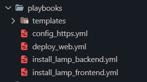
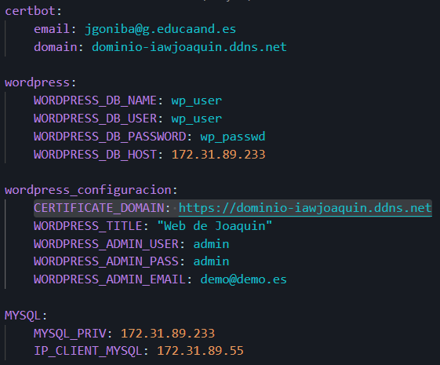
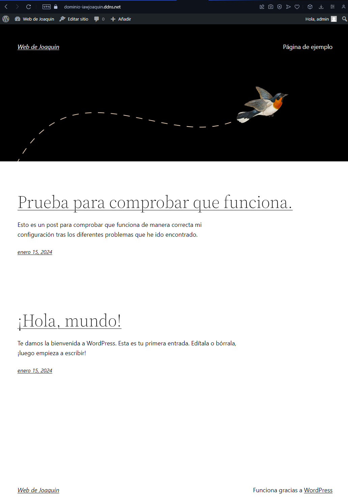
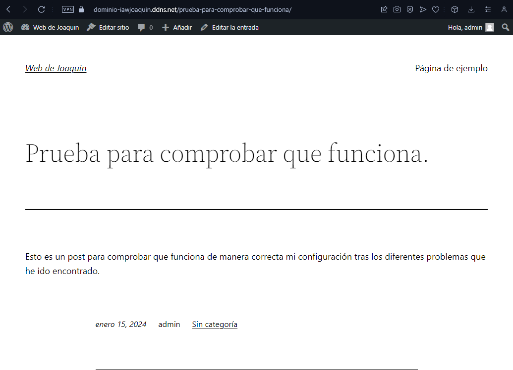
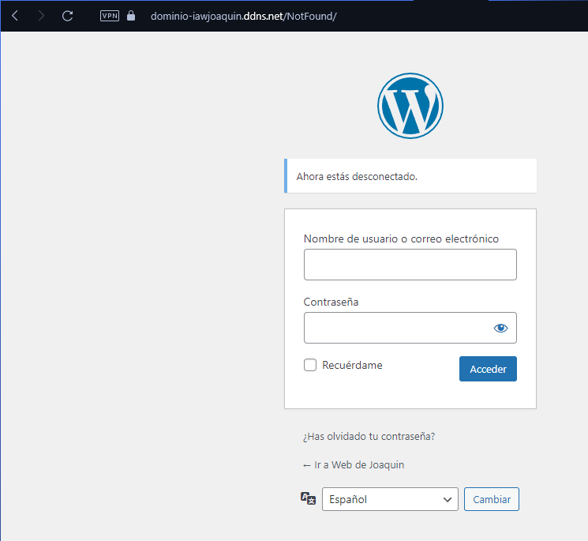

# Practica03-01IAW
Este repositorio es para la Práctica 3 apartado 1 de IAW

- En está práctica tendremos que hacer uso de la herramienta [Ansible](https://www.ansible.com). 

    Ansible es una plataforma de gestión de la configuración que automatiza el almacenamiento, los servidores y las redes. También nos permite como vamos a realizar en esta práctica, poder trabajar sobre dos máquinas a la vez realizando cada configuración correspondiente en cada una de ellas.


## Configuración.

1. Como primer paso tendremos que tener en nuestro laboratorio de *_AWS_* tres máquinas que tendrán la siguiente estructura:

2. Una máquina que se encarga de controlar las otras dos con Ansible. 

3. Una máquina para desplegar [WordPress](https://wordpress.com/es/ppc/lohp-campaign/?utm_source=google&utm_campaign=google_search_wpcom_acquisition_brand_es_es&utm_medium=paid_search&keyword=wordpress&creative=674650391164&campaignid=20575508521&adgroupid=156231933520&matchtype=e&device=c&network=g&targetid=kwd-313411415&utm_content=&gad_source=1&gclid=CjwKCAiAzJOtBhALEiwAtwj8tpWmLcGmZyVWs9r7BgNeq8FoEVLW8tBPuxIcm2__aQKRaeNcgUad6RoCvWUQAvD_BwE) a través de la configuración de *_CLI_* de manera automatizada. 

4. Una máquina que almacene la base de datos de la máquina anterior.

## Uso de Playbook.

- Las playbook se utilizan para organizar los procesos o listado de tareas que queremos realizar sobre cada una de las máquinas correspondientes.

    En mi caso el listado de playbook estará almacenado dentro del directorio *_playbook_* y trendrán la siguiente configuración.

    


### Primer PlayBook.

```
---
- name: Playbook para configurar HTTPS
  hosts: frontend
  become: yes

  vars_files:
    - ../vars/variables.yml

  tasks:

    - name: Desinstalar instalaciones previas de Certbot
      apt:
        name: certbot
        state: absent
    
    - name: Eliminar certificado y configuración de Certbot para el dominio
      command: certbot delete --cert-name "{{ certbot.domain }}"
      ignore_errors: yes

    - name: Instalar Certbot con snap
      command: snap install --classic certbot

    - name: Crear un alias para el comando certbot
      command: ln -s -f /snap/bin/certbot /usr/bin/certbot

    - name: Solicitar y configurar certificado SSL/TLS a Let's Encrypt con certbot
      command:
        certbot --apache \
        -m {{ certbot.email }} \
        --agree-tos \
        --no-eff-email \
        --non-interactive \
        -d {{ certbot.domain }}
```
- El funcionamiento de esta playbook nos permite hacer uso e instalar la herramienta [Cerbot](https://certbot.eff.org), que nos permitirá poder registrar nuestro nombre de dominio. 

### Segunda playbook.

```
---
- name: Playbook para instalar la pila LAMP en el Backend
  hosts: backend
  become: yes

  vars_files:
    - ../vars/variables.yml

  tasks:

    - name: Actualizar los repositorios
      apt:
        update_cache: yes

    - name: Instalar el sistema gestor de bases de datos MySQL
      apt:
        name: mysql-server
        state: present

    - name: Instalamos el gestor de paquetes de Python pip3
      apt: 
        name: python3-pip
        state: present

    - name: Instalamos el módulo de pymysql
      pip:
        name: pymysql
        state: present
    
    - name: Eliminar la base de datos existente
      mysql_db:
        name: "{{wordpress.WORDPRESS_DB_NAME}}"
        state: absent
        login_unix_socket: /var/run/mysqld/mysqld.sock

    - name: Crear una base de datos
      mysql_db:
        name: "{{wordpress.WORDPRESS_DB_NAME}}"
        state: present
        login_unix_socket: /var/run/mysqld/mysqld.sock 

    - name: Crear el usuario de la base de datos
      mysql_user:         
        name: "{{ wordpress.WORDPRESS_DB_USER }}"
        password: "{{ wordpress.WORDPRESS_DB_PASSWORD }}"
        priv: "{{ wordpress.WORDPRESS_DB_NAME }}.*:ALL"
        host: "{{MYSQL.IP_CLIENT_MYSQL}}"
        state: present
        login_unix_socket: /var/run/mysqld/mysqld.sock 

    - name: Configuramos MySQL para permitir conexiones desde cualquier interfaz
      replace:
        path: /etc/mysql/mysql.conf.d/mysqld.cnf
        regexp: 127.0.0.1
        replace: "{{MYSQL.MYSQL_PRIV}}"

    - name: Reiniciamos el servicio de base de datos
      service:
        name: mysql
        state: restarted
```
- Esta playbook nos va a permitir instalar, configurar, y crear la base de datos junto con otros paquetes que encontramos al principio. 

    En este playbook un *error* que he cometido y he solucionado es que no tenía añadida la tarea de eliminar la `base de datos`. Esto quiere decir que aunque lanzase de nuevo el playbook, toda la configuración se almacenada en una base de datos antigua, por lo tanto, la configuración que estaba lanzando no servía para nada.

    Por eso mismo he añadido esa tarea, para eliminar cualquier `base de datos` antes de cualquier otra instalación o creación de ella misma.

### Tercer Playbook.

```
---
- name: Playbook para instalar la pila LAMP en el FrontEnd
  hosts: frontend
  become: yes

  tasks:
    - name: Actualizar los repositorios
      apt:
        update_cache: yes

    - name: Instalar el servidor web Apache
      apt:
        name: apache2
        state: present

    - name: Instalar PHP y los módulos necesarios
      apt: 
        name:
          - php
          - php-mysql
          - libapache2-mod-php
        state: present
     
    - name: Habilitar el módulo rewrite de Apache
      apache2_module:
        name: rewrite
        state: present

    - name: Copiar el archivo de configuración de Apache
      template:
        src: templates/000-default.conf
        dest: /etc/apache2/sites-available/000-default.conf
        mode: 0755
      notify: Restart Apache

    - name: Copiamos el archivo de configuración de PHP
      copy:
        src: /home/ubuntu/Practica03-01IAW/WordPress/php/index.php
        dest: /var/www/html/index.php
        mode: 0755

    - name: Cambiar el propietario y grupo del directorio de Apache
      file:
        path: /var/www/html
        state: directory
        owner: www-data
        group: www-data
        recurse: yes

  handlers:
    - name: Restart Apache
      service:
        name: apache2
        state: restarted
```

- Esta playbook al contrario que la otra, sirve para instalar la pila *_LAMP_* en nuestra máquina FRONTEND.

    El comando `mode` nos permite poder asignar los permisos al directorio o archivo que estemos indicando tras hacer uso de `src y dest`

    El comando `state` nos permite indicar cual es el estado de ese archivo/servicio/directorio...

    `Notify` nos permite indicar el nombre de un `handler` para que se ejecute una vez termine el listado de `task`. 

    Un `Handler` es una instrucción que se ejecuta siempre que se `notify` en una tarea en especifico.

### Cuarto Playbook.

```
---
- name: Playbook para hacer el deploy de la aplicación web WordPress
  hosts: frontend
  become: yes

  vars_files:
    - ../vars/variables.yml

  tasks:
    - name: Eliminamos las descargas anteriores de wordpress.
      file:
        path: /tmp/wp-cli.phar
        state: absent 
  
    - name: Descargamos el código de WordPress con CLI
      get_url:
        url: https://raw.githubusercontent.com/wp-cli/builds/gh-pages/phar/wp-cli.phar
        dest: /tmp
        mode: "+x"

    - name: Hacemos MV para a /usr/bin para poder usarlo sin la ruta completa
      command: mv /tmp/wp-cli.phar /usr/local/bin/wp

    - name: Eliminamos instalaciones previas del directorio /var/www/html
      shell: rm -rf /var/www/html/*
    
    - name: Descargamos el codigo fuente de wpdonwload.
      command: wp core download --locale=es_ES --path=/var/www/html --allow-root

    - name: Configuración de WordPress CLI
      command: 
        wp config create \
        --dbname={{ wordpress.WORDPRESS_DB_NAME }} \
        --dbuser={{ wordpress.WORDPRESS_DB_USER }} \
        --dbpass={{ wordpress.WORDPRESS_DB_PASSWORD }} \
        --dbhost={{ wordpress.WORDPRESS_DB_HOST }} \
        --path=/var/www/html \
        --allow-root

    - name: Instalación de WordPress CLI
      command: wp core install \
        --url="{{wordpress_configuracion.CERTIFICATE_DOMAIN}}" \
        --title="{{wordpress_configuracion.WORDPRESS_TITLE}}" \
        --admin_user="{{wordpress_configuracion.WORDPRESS_ADMIN_USER}}" \
        --admin_password="{{wordpress_configuracion.WORDPRESS_ADMIN_PASS}}" \
        --admin_email="{{wordpress_configuracion.WORDPRESS_ADMIN_EMAIL}}" \
        --path=/var/www/html \ 
        --allow-root
    
    - name: Copiamos el archivo 
      copy:
       src: /home/ubuntu/Practica03-01IAW/WordPress/htaccess/.htaccess
       dest: /var/www/html
       mode: 0755
    
    - name: Pluggin para la seguridad de wordpress.
      command: sudo wp plugin install wp-staging --activate --path=/var/www/html --allow-root

    - name: Pluggin cualquiera para comprobar que podemos instalarlo.
      command: sudo wp plugin install wp-staging --activate --path=/var/www/html --allow-root

    - name: Modificamos los links de wordpress.
      command: sudo wp plugin install wps-hide-login --activate --path=/var/www/html --allow-root
    
    - name: Modificamos los nombres de las URLS.
      command: sudo wp option update whl_page "NotFound" --path=/var/www/html --allow-root

    - name: Modificamos la reestructura de Wordpress con los nombres de las entradas.
      command: sudo wp rewrite structure '/%postname%/' --path=/var/www/html --allow-root

    - name: modificamos por ultima vez los permisos del directorio /var/www/html/
      file:
        path: /var/www/html
        state: directory
        owner: www-data
        group: www-data
        recurse: yes
```
- El playbook más importante ya que contiene toda la instalación de *_WordPress_* a través de CLI.

    Es importante que en el apartado de la configuración de `wp core install` añadamos comillas dobles ("") al lado de las variables, de lo contrario no funcionará.

    Asi mismo como habilitar el módulo `rewrite` de apache para la redirección y la rescritura de la URL.

    El comando `absent` nos permite borrar lo que indiquemos en su tarea.


### Otros archivos a tener en cuenta.

- Otro archivos que hemos copiado de otras prácticas que también son importantes en nuestro correspondiente *_.htaccess_* y nuestro *_000-default.conf_* 

``` 
-- Htaccess

# BEGIN WordPress
<IfModule mod_rewrite.c>
RewriteEngine On
RewriteBase /
RewriteRule ^index\.php$ - [L]
RewriteCond %{REQUEST_FILENAME} !-f
RewriteCond %{REQUEST_FILENAME} !-d
RewriteRule . /index.php [L]
</IfModule>
# END WordPress


# Modulos Rewrite -f y -d: Esta directivas se activan para #cuando no aparecen los archivos o urls que estamos #buscando dentro del servidor. -D es lo mismo que la #anterior pero enfocado a directorios.

#RewriteRule ^index\.php$ - [L]: Nos indicará que si la #soclitud que se esta intentando pedir es un index.php no #realizará ninguna rescritura.

#RewriteRule . /index.php [L]: Esta redirige todas las peticiones a index.php.
```

```
-- 000.default.conf
ServerSignature Off
ServerTokens Prod

#ServerSignature: Elimina información del servidor para posibles ataques. Ya que esto muestra información sobre el si esta ON.
#Server tokens: Responde a las respuesta HTTP para mostrar cualqueir información del servidor.
<VirtualHost *:80>
  #ServerName www.example.com
  ServerAdmin webmaster@localhost
  DocumentRoot /var/www/html
  DirectoryIndex index.php index.html
  <Directory "/var/www/html">
    AllowOverride All
  </Directory>

  ErrorLog ${APACHE_LOG_DIR}/error.log
  CustomLog ${APACHE_LOG_DIR}/access.log combined
</VirtualHost>

```

## Archivos de variables.

- Tendremos que tener una archivo de variables, al que llamaremos en cada playbook haciendo uso de: `vars_file`

    


## Inventario.

- En el inventario almacenamos una serie de datos que son los siguientes:

```


[frontend]
3.211.214.54

[backend]
52.72.40.239

[all:vars]
ansible_user=ubuntu
ansible_ssh_private_key_file=/home/ubuntu/Practica03-01IAW/WordPress/inventory/labsuser.pem
ansible_ssh_common_args='-o StrictHostKeyChecking=accept-new'

#all:vars: almacena información del usuario del ssh.
#ansible_ssh_common_args='-o StrictHostKeyChecking=accept-new': Nos permite poder ejecutar el ssh sin tener que estar aceptando el fingerprint constantemente.

```


## Ejecución.

- Todo los playbook anteriores pueden ejecutarse creado un archivo con la siguiente estructura:

```
---
- import_playbook: playbooks/install_lamp_frontend.yml
- import_playbook: playbooks/install_lamp_backend.yml
- import_playbook: playbooks/config_https.yml
- import_playbook: playbooks/deploy_web.yml


```

- Este archivo se encargará de `llamar` a todas las playbook que le indiquemos y las ejecutará de manera ordenada.

    Para ejecutarlo hacemos uso del siguiente comando:

    `ansible-playbook -i  /home/ubuntu/Practica03-01IAW/WordPress/inventory/inventory main.yml`

    Se pueden añadir `-v`, `-vv`, `-vvv` para obtener mas información mientras se van instalando las playbooks.


## Capturas para comprobar el correcto funcionamiento.


1. 

2. 

3. 
